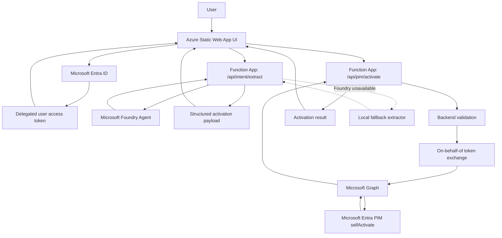

# PIM Activation Orchestrator

This project provides a browser UI and Azure Functions backend for activating eligible Microsoft Entra PIM roles for the signed-in user.

## Current Architecture

```text
User signs in to the Static Web App
  -> Browser gets a delegated Entra access token for this backend API
  -> Browser sends the user's request to the Function App
  -> Function App calls the Foundry agent, or local fallback extractor, to extract role/duration/ticket details
  -> Browser shows the extracted payload for review
  -> Browser sends the activation request to the Function App
  -> Function App validates policy and ticket format
  -> Function App exchanges the user token for a Microsoft Graph token using OBO
  -> Microsoft Graph calls Entra PIM selfActivate
```



The AI agent does not activate PIM directly. The Azure Function App is the enforcement boundary and the only component that calls Microsoft Graph.

## Deployed URLs

- Static Web App UI: `https://yellow-mushroom-01855d00f.7.azurestaticapps.net`
- Function App: `https://knakano-ai-project-app-h9cxeyfufqdhahcx.eastus2-01.azurewebsites.net`

## Supported Requests

Supported roles are configured in [shared/config.py](shared/config.py):

- `AI Reader`
- `Security Reader`

Ticket numbers must start with `#`, for example `#12345`.

Example user request:

```text
Activate my Security Reader role for 2 hours for #12345.
```

Expected extracted payload:

```json
{
  "roleName": "Security Reader",
  "durationHours": 2,
  "ticketNumber": "#12345",
  "justification": "#12345"
}
```

## Backend APIs

### Extract Intent

```http
POST /api/intent/extract
Content-Type: text/plain
```

The browser sends JSON text containing the current access token and the user message:

```json
{
  "accessToken": "<current-user-access-token>",
  "message": "Activate my AI Reader role for 2 hours for #12345."
}
```

The backend returns either structured activation details or a concise follow-up message for missing/invalid fields.

### Activate PIM

```http
POST /api/pim/activate
Content-Type: text/plain
```

The browser sends JSON text containing the current access token and extracted activation details:

```json
{
  "accessToken": "<current-user-access-token>",
  "roleName": "AI Reader",
  "durationHours": 2,
  "ticketNumber": "#12345",
  "justification": "#12345"
}
```

The Function derives the user from the token, checks role eligibility, validates the ticket format, and calls Microsoft Graph:

```http
POST https://graph.microsoft.com/v1.0/roleManagement/directory/roleAssignmentScheduleRequests
```

Expected success responses:

- `201` with Microsoft Graph PIM activation result
- `200 {"message": "PIM is already activated."}`

If the signed-in user is not eligible for the requested role, the backend returns:

```json
{
  "message": "Not eligible for role."
}
```

## Azure Configuration

The Function App requires these app settings:

```text
AZURE_TENANT_ID=<Directory tenant ID>
AZURE_CLIENT_ID=<backend API app registration client ID>
AZURE_CLIENT_SECRET=<backend API client secret>
TICKET_SYSTEM_NAME=ConnectWise
MAX_PIM_DURATION_HOURS=4
FUNCTIONS_WORKER_RUNTIME=python
```

For Foundry-backed extraction, also configure:

```text
FOUNDRY_INTENT_MODE=foundry
FOUNDRY_PROJECT_ENDPOINT=https://knakano-test.services.ai.azure.com/api/projects/knakano-test
FOUNDRY_AGENT_NAME=PIM-Activation
FOUNDRY_AGENT_VERSION=9
FOUNDRY_MANAGED_IDENTITY_CLIENT_ID=<user-assigned-managed-identity-client-id>
FOUNDRY_TOKEN_SCOPE=https://ai.azure.com/.default
```

If Foundry returns a token audience error, try:

```text
FOUNDRY_TOKEN_SCOPE=https://cognitiveservices.azure.com/.default
```

The Function App identity must have access to the Azure AI Foundry project.

## Entra Configuration

This project uses two app registrations:

- Backend API app registration: exposes the `pim.activate` API scope and is used by the Function App for OBO.
- SPA client app registration: used by the Static Web App sign-in flow.

The SPA client requests this delegated scope:

```text
api://2450d4e7-7781-4a1f-885b-710a17d3d31b/pim.activate
```

Add the Static Web App URL as a Single-page application redirect URI:

```text
https://yellow-mushroom-01855d00f.7.azurestaticapps.net
```

For local testing, also add:

```text
http://localhost:8000/orchestrator/
```

## Local Development

Create a virtual environment and install dependencies:

```powershell
python -m venv .venv
.\.venv\Scripts\Activate.ps1
pip install -r requirements.txt
```

Run the Static Web App locally:

```powershell
.\.venv\Scripts\python.exe -m http.server 8000
```

Open:

```text
http://localhost:8000/orchestrator/
```

The Function App can be tested with Azure Functions Core Tools when available:

```powershell
func start
```

## Deployment

Static Web App files live in [orchestrator](orchestrator). The GitHub Actions workflow deploys this folder to Azure Static Web Apps when changes are pushed to `main`.

Backend changes in [function_app.py](function_app.py) or [shared](shared) require redeploying the Azure Function App.

## Security Notes

Do not commit local secrets or tokens. The repository intentionally ignores:

- `local.settings.json`
- `.local/`
- `.venv/`
- `*.env`

The Foundry agent should only extract structured request details. It must not call Microsoft Graph, invent role IDs, invent principal IDs, or activate PIM directly.
